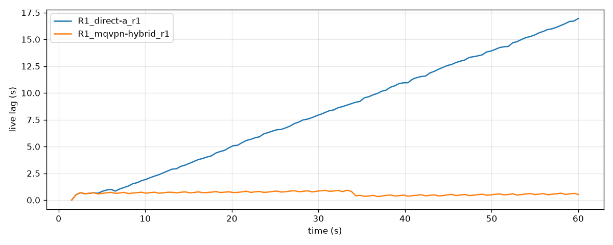
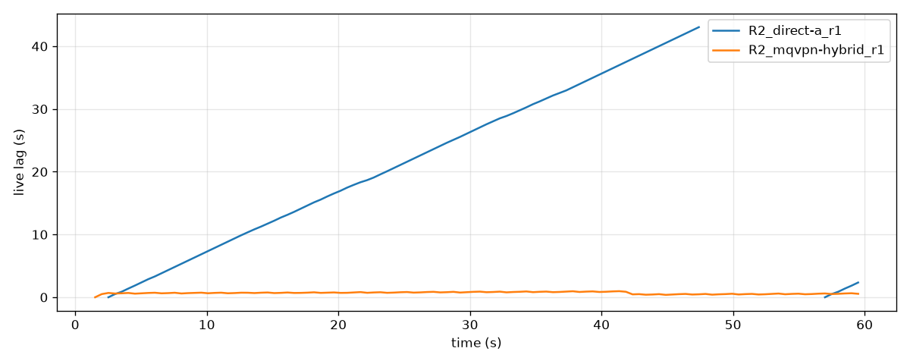
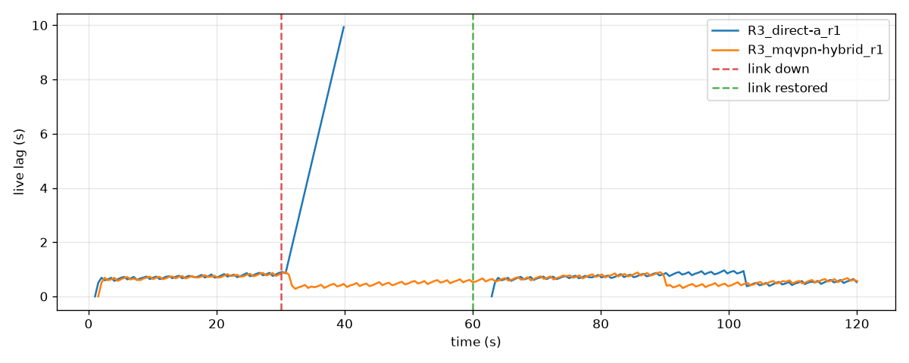

# RTMP Link Bonding Benchmark (direct vs mqvpn)

Date: 2026-08-11.
Version under test: mqvpn v0.16.0.

## RTMP is tied to a single connection

For live streaming from the field (event coverage, outdoor and IRL
streaming), the whole stream depends on one mobile connection.
RTMP is the most widely accepted contribution protocol (YouTube Live,
Twitch, and most other services ingest it), but it runs over a single TCP
connection: when the connection degrades the stream degrades with it, and
when the connection drops the stream drops too.

Using several connections at once to carry one stream is called
**bonding**.
RTMP itself has no bonding mechanism.
Commercial hardware shares this constraint: LiveU's documentation states
that when streaming RTMP directly from the unit, it cannot bond multiple
connections[^liveu].
To bond, the unit sends a proprietary protocol to LiveU's cloud, which
converts the stream back to RTMP and forwards it to the destination.

mqvpn bonds RTMP without any conversion step or dedicated cloud.
The streaming software sees an ordinary RTMP server, the destination sees
an ordinary RTMP client, and all the bonding happens inside the tunnel.
The only change on the encoder (OBS or similar) is the destination
address; the streaming service needs no support at all.

This report measures how much that construction actually buys, on a
reproducible emulated network, comparing two setups: **direct** (RTMP
straight over a single connection) and **mqvpn** (RTMP through a tunnel
bonding two connections).
The conclusions first:

- Bonding weak links: on links that individually cannot carry 8 Mbps
  (6 Mbps × 2), direct capped out at 5.7 Mbps and fell about 17 seconds
  behind live within a 60-second stream. mqvpn sustained 7.8 Mbps with
  less than 1 second of drift.
- Stability on a lossy link: under intermittent packet loss modeled on a
  weak mobile connection, direct disconnected 4 times per 60 seconds on
  average and was effectively unusable (0.9 Mbps). mqvpn had 0
  disconnects, 0 seconds of downtime, and held 7.9 Mbps.
- Surviving a link failure: cutting one of the two links for 30 seconds
  mid-stream stopped the direct stream for about 33 seconds. mqvpn had 0
  disconnects and 0 seconds of downtime — the stream just kept going.

## Test environment

Real links cannot be controlled or replayed, so the measurements ran on an
emulated network built from Linux network namespaces and netem.

- The publisher and the RTMP server are connected by two virtual links;
  bandwidth, delay, and loss are set per condition
- The stream is 1080p30, 8 Mbps video plus 160 kbps audio — a practical
  rate at Twitch's cap and inside YouTube's 1080p recommendation
- The publisher mimics OBS: if no data moves for 10 seconds it treats the
  connection as dead and retries every 2 seconds
- Each condition runs a 60- or 120-second stream three times; means are
  reported

The three conditions:

| Condition | Link A | Link B | Models |
|---|---|---|---|
| (1) Bonding weak links | 6 Mbps, 20 ms delay | 6 Mbps, 20 ms delay | neither link alone can carry 8 Mbps |
| (2) Bursty loss | 100 Mbps, 50 ms delay, intermittent loss[^gemodel] | 100 Mbps, 50 ms delay | a mobile connection with poor signal |
| (3) Link failure | 12 Mbps, 10 ms delay | 12 Mbps, 30 ms delay | link A cut 30 s into the stream, restored 30 s later |

Four metrics, each mapping to what a viewer experiences:

- **Disconnects**: how many times the streaming software was forced to
  reconnect
- **Stream downtime**: total time, after the stream is up, during which no
  data reached the destination for more than 1 second (the viewer sees a
  frozen stream). The start-up gap right after connecting (about 1 second,
  common to every setup) is excluded[^deadair]
- **Drift behind live**: how far the stream fell behind real time as
  sending backed up
- **Delivered bitrate**: what the destination actually received, averaged
  over the time the stream was up (so it reflects quality while streaming;
  the length of outages shows up in stream downtime instead)

## Result 1: bonding two weak links

| | direct | mqvpn |
|---|---|---|
| Delivered bitrate | 5.7 Mbps | 7.8 Mbps |
| Drift behind live (max) | 16.9 s | 0.9 s |
| Disconnects | 0 | 0 |

direct hits the physical limit of link A (6 Mbps); the surplus piles up
and becomes a drift of about 17 seconds within a minute.
A 17-second delay is the point where interacting with chat stops working.
mqvpn carries the 8 Mbps stream over the combined capacity of both links,
with drift under 1 second.



This is the drift the condition-1 video cannot show directly: direct
falls further behind every second, while mqvpn holds under one second.

## Result 2: keeping a stream alive on a lossy link

| | direct | mqvpn |
|---|---|---|
| Disconnects | 4.0 | 0 |
| Stream downtime (of 60 s) | 41.8 s | 0 s |
| Drift behind live (max) | 43.0 s | 1.0 s |
| Delivered bitrate | 0.9 Mbps | 7.9 Mbps |

Under sustained packet loss, TCP keeps retransmitting and sending stalls.
For direct, those stalls repeatedly exceeded the 10-second disconnect
threshold: out of 60 seconds, nothing reached the destination for 42.
With mqvpn, loss recovery is handled inside the tunnel per link, so the
streaming software only ever sees a stable path.
All three runs came out identical: 0 disconnects, 0 s downtime, 7.9 Mbps
(even sub-second wobbles in arrival never exceeded about 0.5 s).



The chart shows drift as seen from the sender; gaps in a line are periods
where the software's connection was dead.

## Result 3: the stream survives a link failure

| | direct | mqvpn |
|---|---|---|
| Disconnects | 8.7 | 0 |
| Stream downtime (of 120 s) | 32.9 s | 0 s |
| Time from link recovery to stream recovery | 2.2–4.0 s | n/a (never stopped) |
| Delivered bitrate | 8.0 Mbps | 8.1 Mbps |

With direct, the stream's TCP connection dies with the link.
The software keeps retrying, but with only that one link the retries fail
until the link itself returns.
This is why the downtime (32.9 s) exceeds the cut itself: the 30-second
cut plus the 2–4 seconds it takes, after recovery, for a reconnect to
succeed and the first media to arrive (stall detection completes during
the cut, so it adds nothing on top).
mqvpn switches to the surviving link B immediately and the software's
connection never drops.
The behaviour was identical in all three runs.



The red dashed line marks the cut of link A, the green one its recovery.
The mqvpn line is unbroken because the connection never dropped.
The 0 s downtime figure has backing at the measurement's resolution: in
all three runs, the interval between bytes arriving at the receiver never
exceeded a single 250 ms polling period around either event.
Both the cut and the recovery of link A are handled too smoothly for the
receiver to detect.

direct's bitrate matching mqvpn's in the table is a property of the
metric, which averages over the time the stream was up (the surviving
12 Mbps link is plenty for an 8 Mbps stream, so quality while live does
not suffer).
The difference shows up as 33 seconds of downtime and 8.7 disconnects,
not as bitrate.

We also recorded the comparison with real video (Big Buck Bunny[^bbb])
under the same conditions.
The direct side turns into a 32.8-second "signal lost" slate (matching
the measured downtime); the mqvpn side keeps playing throughout.

- [Video: side-by-side under condition 3 (direct vs mqvpn)](../../bench_results/rtmp/video/r3_flap_direct_vs_mqvpn.mp4)
- [Video: side-by-side under condition 1](../../bench_results/rtmp/video/r1_starved_direct_vs_mqvpn.mp4)

In the condition-1 video, the direct side appears to stop past the
45-second mark.
That is not a disconnect: over the 60-second run only 45.6 seconds of
video reached the destination on the direct side (57.7 seconds — nearly
the whole run — on the mqvpn side), so the delivered footage simply runs
out early.
This is what "drift behind live" from the table looks like on video.

## Configuration

For TCP-based protocols such as RTMP, enable the tunnel's hybrid TCP
lane.
On the client, two lines:

```ini
[Hybrid]
Enabled = true
Tcp = stream
```

On the server, the same plus an allowlist entry for the destination:

```ini
[Hybrid]
Enabled = true
Tcp = stream
EgressAllow = <destination address range>
```

## Limitations and reproduction

The numbers come from an emulated network; on real links they will vary
with signal conditions and carrier equipment.
Everything needed to reproduce the measurements is in the repository:
run `scripts/benchmark_rtmp.sh` (metrics) and
`scripts/benchmark_rtmp_video.sh` (real video) as root.
Aggregated and raw data live under `bench_results/rtmp/`.
For the same kind of measurement with a UDP-based protocol (SRT), see the
existing SRT report (`bench_results/srt/REPORT.md`).

[^liveu]: What Is RTMP Direct Mode? (LiveU Solo Help Center) <https://solohelp.liveu.tv/hc/en-us/articles/13949406405403-What-Is-RTMP-Direct-Mode>: "When selecting to stream via RTMP directly from the LiveU Solo unit, the unit cannot bond multiple connections."
[^gemodel]: Intermittent loss averaging about 10%, generated with netem's Gilbert-Elliott model (parameters 4% 30% 80% 0.5%): alternating good and high-loss periods, the loss pattern typical of mobile links.
[^deadair]: Byte growth of the receiver-side (RTMP server) recording is polled every 250 ms; any pause in growth longer than 1 second counts as downtime. Data counts only if it reached the destination — a sender that is alive but not getting through still accrues downtime. The start-up gap before the encoder emits its first media (about 1 second, common to every setup) is not mid-stream downtime and is excluded from the tables in this report; the aggregated data in the repository (`bench_results/rtmp/results_tier1.csv`) is the raw value including that ramp, about 1 second larger than the tables here. The implementation of the metric is in `benchmarks/rtmp_analyze.py`.
[^bbb]: Big Buck Bunny © Blender Foundation (CC-BY 3.0) <https://peach.blender.org/>
